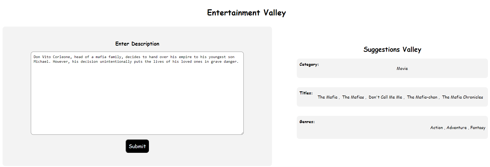

# Entertainment.Valley
Entertainment Valley is the project of multiple machine learning approaches. 
This contains single-label text classification, multilabel text classification and use of text summarization to 
generate titles. 

# Data Collection
Data was collected from multiple Kaggle Datasets.

# Data Preprocessing
Multiple preprocessing steps have to be taken for collected datasets. 
For each subject, we have to preprocess the dataset for training. 
On average, we collected 50K dataset from each category.  

# Model Training
Fine-tuned the t5-base, distilrobera-base model from HuggingFace Transformers using Fastai and Blurr. 
The model training notebook can be viewed [here](notebooks)

# Model Compression and ONNX Inference
The trained models have a memory of `900+MB` each.
I compressed this model using ONNX quantization and brought it under `78.7MB`.

# Model Deployment
The compressed model is deployed to HuggingFace Spaces Gradio App. The implementation can be found in 
the [apps](apps) folder or [category](https://huggingface.co/spaces/myte/ev-entertainment-category),
[title](https://huggingface.co/spaces/myte/ev-entertainment-title), 
[genre](https://huggingface.co/spaces/myte/ev-entertainment-genre).

# Web Deployment
Deployed a Flask App built to take description and show the category, titles and genres as output. 
Check [docs](docs) folder. 
The website is live [here](https://entertainment-valley.onrender.com/)

